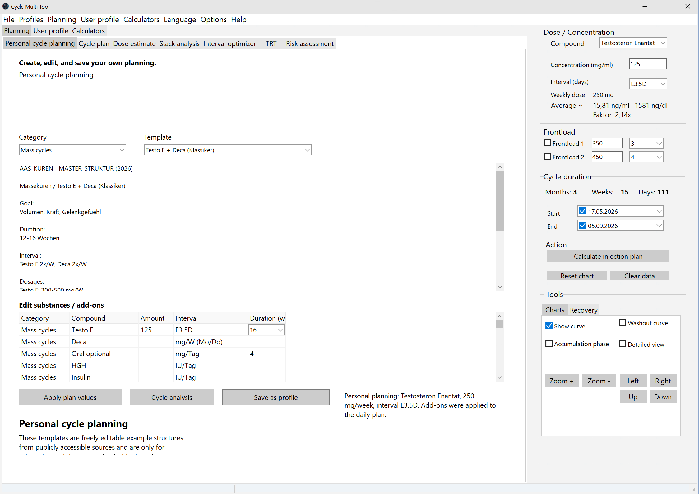
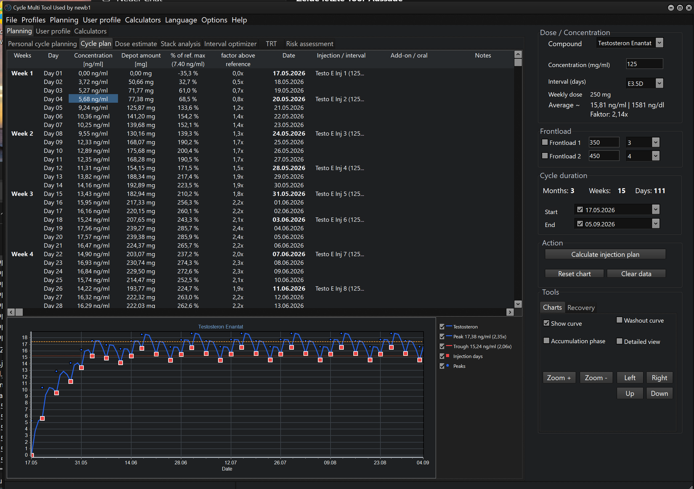
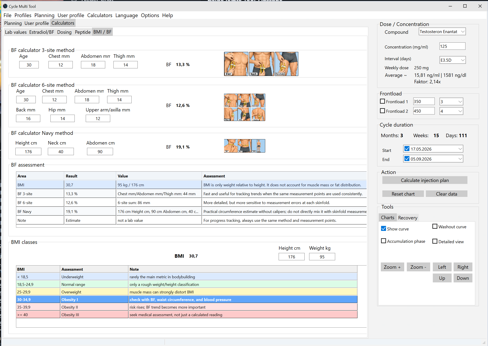
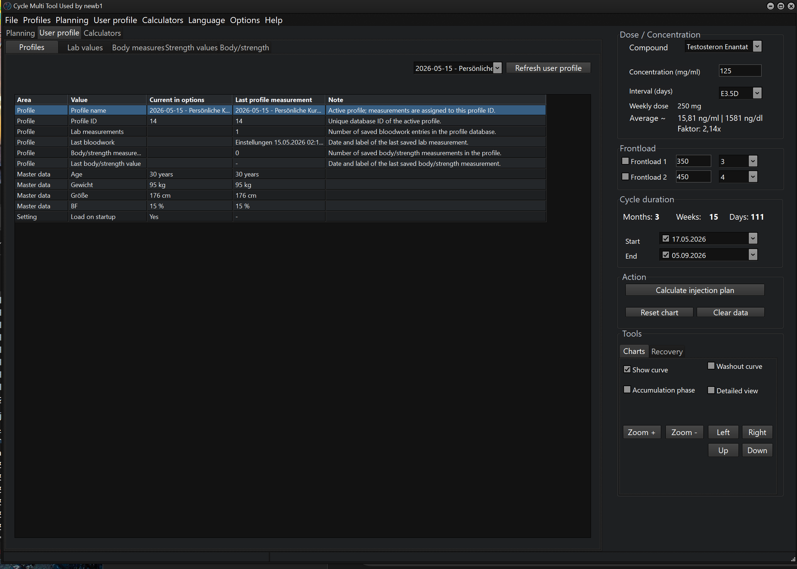
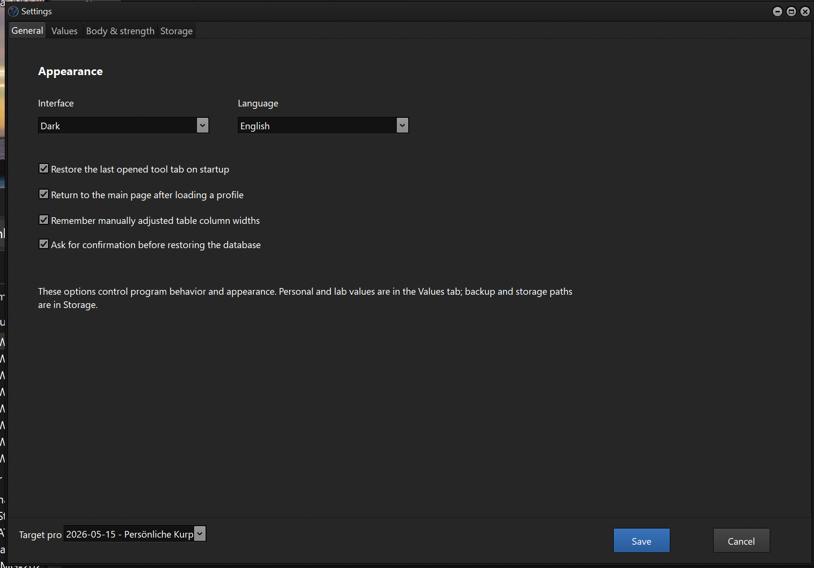

# CycleMultiTool

CycleMultiTool ist eine lokale Windows-Desktop-Anwendung zum Planen, Dokumentieren und Vergleichen eigener Daten. Das Programm sammelt Profile, Laborwerte, Körper- und Kraftwerte, Kurplanung, Rechner und Diagramme an einem Ort.

## Download

Die aktuelle öffentliche Version steht auf der Releases-Seite bereit:

[CycleMultiTool herunterladen](https://github.com/cyclemultitool/CycleMultiTool/releases/latest)

Aktuelles Update: `1.0.2` mit erweiterten Laborwerten für Harnsäure, ApoB/ApoA1 und HOMA-IR.

## Update 1.0.2

- Laborwerte um Harnsäure mg/dl erweitert.
- Lipid-/Risikoansicht um ApoB, ApoA1 und ApoB/ApoA1-Quotient erweitert.
- HOMA-IR wird aus Nüchtern-Glukose und Nüchtern-Insulin berechnet.
- HOMA-IR-Hinweis mit grober Orientierung ergänzt: `<1` sehr gut, `1-2` meist unauffällig, `2-2,5` Graubereich, `>2,5` erhöht.
- Bestehende Profildatenbanken werden beim Start um die neuen Labor-Snapshot-Spalten migriert.

## Screenshots

### Persönliche Kurplanung

### Kurplan und Verlauf

### Rechner

### Profile

### Einstellungen

## Inhalt der Veröffentlichung

Die Veröffentlichung enthält:

- Windows-EXE
- deutsche und englische README-Dateien
- Release-Informationen

Haftungs-, Datenschutz- und Changelog-Hinweise sind in den README-Dateien enthalten.

## Kein Quellcode

Dieses Repository veröffentlicht nur das fertige Programm als Download. Quellcode, Datenbanken, Backups und personenbezogene Daten sind nicht enthalten.

## Wichtiger Hinweis

CycleMultiTool bietet keinen medizinischen Rat und ist kein medizinisches Gerät. Es ersetzt keine medizinische Untersuchung, Laborinterpretation oder Behandlung. Alle Werte sind Dokumentations- und Plausibilitätswerte und müssen eigenverantwortlich geprüft werden.

## Rechtlicher und medizinischer Hinweis

CycleMultiTool dient ausschließlich der privaten Dokumentation, Berechnung, Plausibilitätsprüfung und übersichtlichen Darstellung eigener Daten.

Das Programm gibt keine medizinischen Empfehlungen, keine Behandlungsanweisungen, keine Dosierungsempfehlungen und keine Anwendungsempfehlungen. Es fordert nicht zur Einnahme, Beschaffung oder Anwendung von verschreibungspflichtigen, verbotenen oder leistungssteigernden Substanzen auf.

Alle Berechnungen, Diagramme, Schätzungen und Bewertungen sind technische Dokumentations- und Plausibilitätswerte. Sie ersetzen keine ärztliche Untersuchung, keine Laborinterpretation, keine Diagnose und keine Behandlung.

Die Nutzung erfolgt eigenverantwortlich. Medizinische Fragen, Laborwerte, gesundheitliche Beschwerden und Entscheidungen über Medikamente oder Substanzen gehören in die Hände qualifizierter medizinischer Fachpersonen.

CycleMultiTool speichert und verarbeitet Daten lokal auf dem eigenen Gerät. Die öffentliche Veröffentlichung enthält keinen Quellcode, keine Datenbanken, keine Backups und keine personenbezogenen Nutzerdaten.

## English

CycleMultiTool is a local Windows desktop application for planning, documenting, and comparing personal data. It combines profiles, lab values, body and strength values, cycle planning, calculators, and charts in one place.

The current public version is available on the [Releases page](https://github.com/cyclemultitool/CycleMultiTool/releases/latest).

Update `1.0.2` adds uric acid, ApoB, ApoA1, the ApoB/ApoA1 ratio, and calculated HOMA-IR with an orientation note to the lab/profile overview.

The release contains the Windows executable, German and English README files, and release information. Legal, privacy, and changelog notes are included in the README files.

This repository contains the public release package only. No source code, databases, backups, exports, profile data, or personal user data are included.

## Legal and Medical Notice

CycleMultiTool is intended solely for private documentation, calculation, plausibility checking, and structured visualization of personal data.

The program does not provide medical advice, treatment instructions, dosage recommendations, or usage recommendations. It does not encourage the use, purchase, acquisition, or application of prescription-only, prohibited, or performance-enhancing substances.

All calculations, charts, estimates, and assessments are technical documentation and plausibility values only. They do not replace medical examination, laboratory interpretation, diagnosis, or treatment.

Use of the software is at the user's own responsibility. Medical questions, lab values, health symptoms, and decisions about medication or substances should be handled by qualified medical professionals.

CycleMultiTool stores and processes data locally on the user's own device. The public release does not include source code, databases, backups, exports, profile data, or personal user data.
